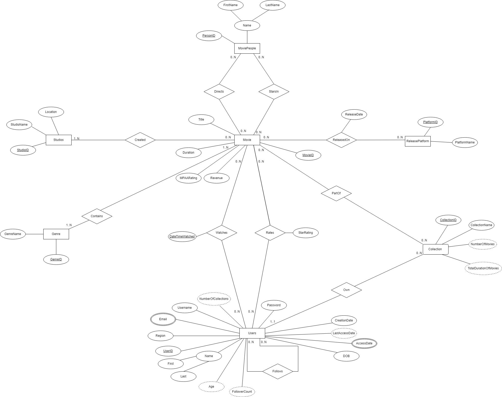

# DBMS Project

This project is a database management system (DBMS) application designed to interact with a PostgreSQL database. It includes functionality for managing movies, users, and collections, as well as generating and modifying database data. The application establishes a secure connection to the database using SSH tunneling and provides tools for both database interaction and data management.

## Enhanced Entity Diagram



## Project Structure

### Key Files and Directories

- **`connection.py`**: Establishes a secure connection to the database using SSH tunneling and calls the main application logic.
- **`data_manager.txt`**: A template for creating a `data_manager.py` script to manage and modify database data.
- **`movies/`**: Contains modules for handling movie-related functionality:
  - `auth.py`: Handles user authentication.
  - `collection.py`: Manages movie collections.
  - `movie.py`: Contains logic for managing individual movies.
  - `user.py`: Handles user-related operations.
- **`movies_app.py`**: The main application script that integrates the functionality from the `movies/` directory.
- **`README.md`**: Documentation for the project.

## Setup

1. Clone the repository to your local machine.
2. Install the required Python libraries:
   ```sh
   pip install psycopg sshtunnel python-dotenv faker
3. Create a .env file in the root directory with the following variables:

- RIT_USERNAME=<your_ssh_username>
- RIT_PASSWORD=<your_ssh_password>

# DBMS Project

This project is a database management system (DBMS) application designed to interact with a PostgreSQL database. It includes functionality for managing movies, users, and collections, as well as generating and modifying database data. The application establishes a secure connection to the database using SSH tunneling and provides tools for both database interaction and data management.

## Project Structure

.gitignore

connection.py

data_manager.txt

movies/
    __init__.py
    auth.py
    collection.py
    movie.py
    user.py

movies_app.py

README.md

### Key Files and Directories

- **`connection.py`**: Establishes a secure connection to the database using SSH tunneling and calls the main application logic.
- **`data_manager.txt`**: A template for creating a `data_manager.py` script to manage and modify database data.
- **`movies/`**: Contains modules for handling movie-related functionality:
  - `auth.py`: Handles user authentication.
  - `collection.py`: Manages movie collections.
  - `movie.py`: Contains logic for managing individual movies.
  - `user.py`: Handles user-related operations.
- **`movies_app.py`**: The main application script that integrates the functionality from the `movies/` directory.
- **`README.md`**: Documentation for the project.

## Features

- Secure database connection using SSH tunneling.
- Modular design for managing movies, users, and collections.
- Data generation and modification using the Faker library.
- Easy-to-extend architecture for adding new features.
